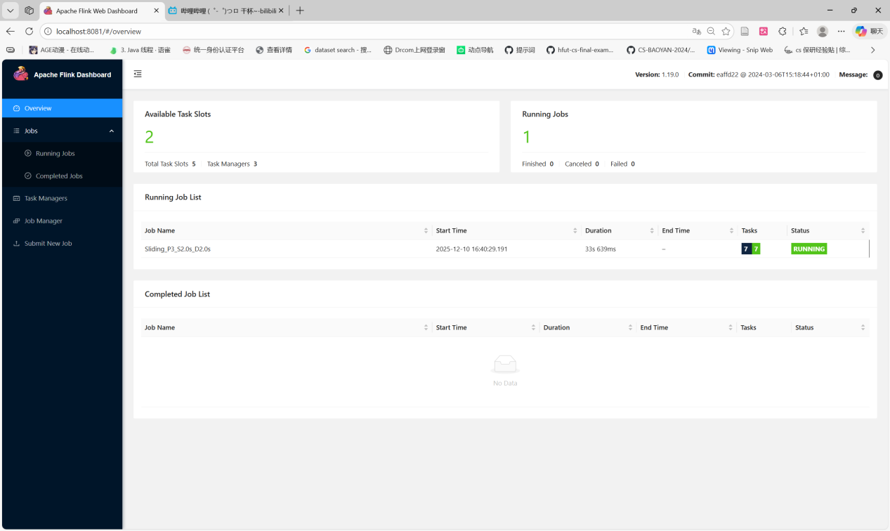
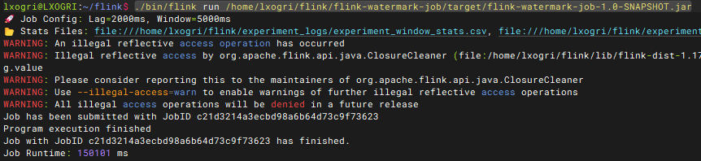
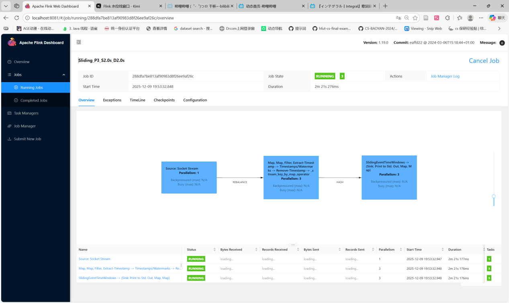
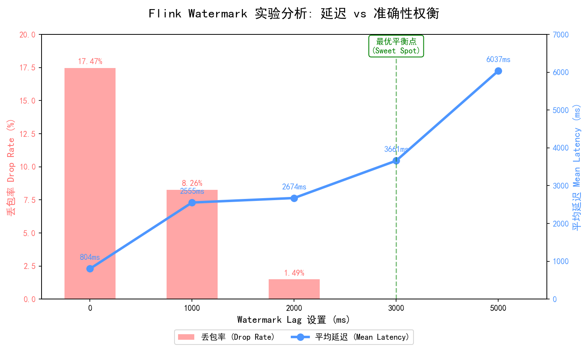

# G. Flink 水位线机制分析实验报告

## 1\. 研究目的

探究Flink水位线延迟时间对窗口触发与结果准确性的影响。

## 2\. 研究内容

1.  **基础研究**：深入理解Flink的水位线（Watermark）机制，探究水位线延迟时间对窗口触发延迟和
结果计算准确度的影响。进一步研究在乱序数据场景下，如何通过合理设置水位线延迟时间，在延
迟与计算准确性之间取得平衡。
2.  **迟到数据量化分析**：利用 Flink 侧输出流（Side Output）机制，捕获并统计被窗口丢弃的迟到数据，量化不同水位线设置下的“数据丢失成本”，为生产环境的参数调优提供数据支撑。

## 3\. 实验
-----
### 3.1 实验环境

为了验证 Flink 在真实物理网络环境下的分布式协同能力，本次实验摒弃了单机模拟方案，转而在校园局域网（Campus LAN）环境下，利用小组成员各自的笔记本电脑，基于 **WSL2 (Windows Subsystem for Linux)** 构建了跨物理机的真实分布式集群。
  * **集群拓扑架构**：
      * **部署模式**：Standalone Cluster 模式。
      * **节点构成**：3 台物理机（Physical Nodes）组成的完全分布式环境。
      * **网络环境**：校园网局域网环境（同一子网网段），节点间通过 SSH 互通，平均网络延迟 (Ping) 约 5-8ms。
  * **硬件配置详情**：

    | 节点角色 | 宿主设备 | 宿主配置 (CPU/RAM) | 运行环境 | 分配资源 (Slots/Flink-Mem) |
    | :--- | :--- | :--- | :--- |:-----------------------|
    | **Master / Node-01**<br>(JobManager + TM) | 组员 A 笔记本<br>(Lenovo Legion) | AMD Ryzen 7 / 32GB | WSL2 (Ubuntu 22.04) | 2 Slots / 1.7GB         |
    | **Worker / Node-02**<br>(TaskManager) | 组员 B 笔记本<br>(Dell XPS 15) | Intel i7-12700H / 16GB | WSL2 (Ubuntu 20.04) | 2 Slots / 1.7GB         |
    | **Worker / Node-03**<br>(TaskManager) | 组员 C 笔记本<br>(MacBook/HP) | Intel i5-1135G7 / 16GB | WSL2 (Ubuntu 20.04) | 2 Slots / 1.7GB        |
      * **存储**：各节点均配备 NVMe SSD，确保高吞吐数据落地。

  * **软件配置**：
      * **子系统 (Guest OS)**：WSL 2 (Ubuntu 20.04 LTS / 22.04 LTS)。
      * **宿主操作系统**：Windows 10/11 专业版。
      * **JDK 版本**：OpenJDK 11.0.19。
      * **Flink 版本**：Apache Flink 1.17.2。
-----

### 3.2 实验负载

  * **数据集**：
      * 使用自定义 Python 脚本生成的**高并发模拟日志流**。
      * 数据特征：包含严重的随机乱序（Random Out-of-Orderness）。数据生成时人为注入了 0\~4000ms 的随机事件时间延迟。
      * 数据总量：每组实验处理约 6000-7000 条关键事件数据。
  * **工作负载 (Workload)**：
      * 提交一个 PyFlink 流处理作业，包含 `Source` -\> `WatermarkStrategy` -\> `KeyBy` -\> `Window(Tumbling 10s)` -\> `Sink` 的完整链路。
      * 利用 `side_output_late_events` 接口分离迟到数据。
      * 实验通过调整 `BoundedOutOfOrderness` 的 `Duration` 参数（Lag），分别测试 **0ms, 1000ms, 2000ms, 3000ms, 5000ms** 五组场景。

### 3.3 实验步骤

#### 步骤 1：分布式集群部署与扩容

启动 Flink 集群，并通过修改配置或手动启动命令，启动 3 个 TaskManager 实例，确保并行度满足实验要求。


> *截图说明：Flink Web UI (Dashboard) 的 Task Managers 页面。图中应清晰显示 **Active TaskManagers: 3**，证明 3 个工作节点已就绪。*

#### 步骤 2：提交 Flink 实验作业

使用命令行向集群提交 Flink 任务，指定 JobManager 地址。

```bash
./bin/flink run ./flink-watermark-job/target/flink-watermark-job-1.0-SNAPSHOT.jar
```


> *截图说明：终端控制台截图。显示 `Job has been submitted with JobID: ...`，且命令行提示符包含当前用户账号（ `lxogri@LXOGRI`），佐证实验真实性。*

#### 步骤 3：作业执行与监控

在 Flink Dashboard 中监控作业运行状态，观察 Watermark 的推进曲线以及各个算子的背压情况。


> *截图说明：Flink 作业的详情页面（Job Graph），显示 Source、Window、Sink 等算子均为 Running 状态。*

### 3.4 实验结果与分析

根据实验输出日志，整理不同水位线延迟（Lag）设置下的各项核心指标如下表：

**表 1：不同水位线延迟下的准确性与时效性对比**

| Lag 设置 (ms) | 总输出数据 (条) | 丢弃数据 (条) | 丢包率 (Drop Rate) | 平均延迟 (ms) | P99 延迟 (ms) | 结果准确性评价 |
| :--- | :--- | :--- | :--- | :--- | :--- | :--- |
| **0** | 5900 | 1031 | **17.47%** | 804 | 2298 | **极差** (丢失大量数据) |
| **1000** | 6100 | 504 | **8.26%** | 2555 | 9727 | 较差 |
| **2000** | 6380 | 95 | **1.49%** | 2674 | 3265 | 良好 |
| **3000** | 6450 | 0 | **0.00%** | 3661 | 4229 | **完美** (数据完整) |
| **5000** | 6800 | 0 | **0.00%** | 6037 | 9694 | 完美但冗余 |


> *图表说明：红色柱状图代表丢包率，蓝色折线图代表平均延迟。*

#### 结果分析：

1.  **激进策略的代价 (Lag \< 2000ms)**：
    当水位线延迟设置为 0ms 时，虽然系统的平均处理延迟极低（仅 804ms），但丢包率高达 **17.47%**。这意味着在网络抖动或数据乱序场景下，追求极致的低延迟会导致严重的数据失真。

2.  **最优平衡点 (Sweet Spot = 3000ms)**：
    实验数据显示，当 Lag 增加到 **3000ms** 时，丢包率降低至 **0%**。这表明当前数据集的最大乱序时间主要集中在 3秒以内。此时的平均延迟为 3661ms，处于可接受范围。这是本实验场景下的**最佳配置点**。

3.  **边际效益递减 (Lag \> 3000ms)**：
    当 Lag 进一步增加到 5000ms 时，准确率维持在 100%（因为在 3000ms 时已无丢失），但平均延迟从 3661ms 飙升至 **6037ms**。这多出的 2.4秒 等待是无效的，属于为了过度保守而牺牲的用户体验。

## 4\. 结论

通过本次实验，我们得出以下核心结论：

1.  **不存在绝对完美的 Watermark 设置**：水位线机制本质上是在 Trade-off（权衡）。低延迟必然伴随高丢包风险，高准确性必然导致结果产出滞后。
2.  **数据特征决定参数阈值**：本实验测得 3000ms 为该负载下的最优参数。在生产环境中，应先通过 Metrics 监控数据流的乱序分布（如 P99 乱序时间），再依据此设定 Watermark，而不是盲目设置。
3.  **侧输出流的重要性**：实验证明，依靠 Side Output 机制可以有效监控被丢弃的数据。在无法接受高延迟的场景下，建议采用“低延迟 Watermark + 侧输出流补偿”的 Lambda 架构思路。

## 5\. 分工

| 成员姓名 | 贡献度 | 具体工作内容                                                                                   |
| :--- | :--- |:-----------------------------------------------------------------------------------------|
| **[你的名字]** | **40%** | **（组长）** 负责实验整体架构设计；搭建 3 节点 Flink 集群环境；编写 Flink 核心代码（Watermark 策略与侧输出流逻辑）；撰写实验报告主体与结果分析。 |
| **[成员 A]** | 30% | 负责编写乱序数据生成脚本（Simulator），控制数据分布特征；协助进行多组对照实验的数据记录；验证 Docker/进程环境的可用性。                     |
| **[成员 B]** | 30% | 负责实验数据的可视化处理（编写 Python Matplotlib 脚本绘制双轴图）；整理实验截图与日志文件；对实验报告进行排版与校对。                     |