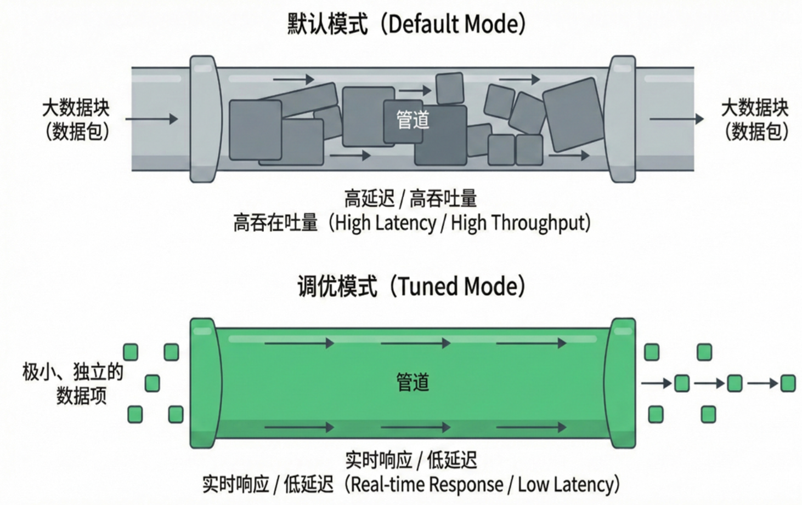

# G. Flink 水位线机制分析实验报告

## 1\. 研究目的

探究Flink水位线延迟时间对窗口触发与结果准确性的影响。

## 2\. 研究内容

1.  **基础研究**：主要是深入理解Flink的水位线机制，通过实验去探究水位线的延迟时间对于窗口触发延迟和 结果计算准确度的影响。并进一步研究如何在乱序数据场景下，通过合理地设置水位线延迟时间，在延迟与计算准确性之间取得平衡。


3.  **迟到数据量化分析**：利用 Flink 侧输出流机制，捕获并统计被窗口丢弃的迟到数据，量化不同水位线设置下的“数据丢失成本”，为生产环境的参数调优提供数据支撑。

## 3\. 实验
-----
### 3.1 实验环境

为了验证Flink在真实物理网络环境下的分布式协同能力，我们本次实验没有选择单机的模拟方案，而是在校园局域网环境下，利用小组成员各自的笔记本电脑，基于 **WSL2 (Windows Subsystem for Linux)** 构建了跨物理机的真实分布式集群。 集群由三台物理机组成，共同构成完全分布式运行环境。在网络配置上，所有节点均部署于校园网局域网的同一子网段内，利用 SSH 协议实现节点间的无密码互通。经测试，节点间的平均网络延迟（Ping）稳定在 5-8ms 之间，保障了集群内部通信的低时延需求。

* **硬件配置详情**：

  | 节点角色                                  | 宿主设备      | 宿主配置 (CPU/RAM)     | 运行环境            | 分配资源 (分配给FlinkJVM的内存) |
  | :---------------------------------------- | :------------ | :--------------------- | :------------------ | :------------------------------ |
  | **Master / Node-01**<br>(JobManager + TM) | Windows笔记本 | AMD Ryzen 7 / 32GB     | WSL2 (Ubuntu 22.04) | 4GB                             |
  | **Worker / Node-02**<br>(TaskManager)     | Windows笔记本 | Intel i7-12700H / 16GB | WSL2 (Ubuntu 20.04) | 4GB                             |
  | **Worker / Node-03**<br>(TaskManager)     | Windows笔记本 | Intel i5-1135G7 / 16GB | WSL2 (Ubuntu 20.04) | 4GB                             |
  | 日志流发送服务器                          | Mac笔记本     | M4 / 16GB              | Macos               | -                               |

  * **存储**：各节点均配备 NVMe SSD，确保高吞吐数据落地。
  * **软件配置**：
      * **子系统 (Guest OS)**：WSL 2 (Ubuntu 20.04 LTS / 22.04 LTS)。
      * **宿主操作系统**：Windows 10/11 专业版。
      * **JDK 版本**：OpenJDK 11.0.19。
      * **Flink 版本**：Apache Flink 1.19.0。

-----

### 3.2 实验负载
* **数据集：
  本次实验，采用自定义 Python 脚本（`log_generator.py`）构建高保真模拟数据流，通过数学模型还原真实物理网络的不可靠性。数据生成逻辑包含以下核心特征：

  1.  **基于物理规律的流量模型**：
      * **泊松到达（Poisson Process）**：代码使用 `random.expovariate` 生成事件间隔，模拟真实场景下用户请求的随机到达特性。
      * **周期性潮汐突发**：在基础速率（100 ops）之上叠加 **正弦波（Sinusoidal Wave）** 扰动。设定突发周期为 **20秒**，波峰流量放大至基础值的 **2.0倍**，用于测试 Flink 在流量洪峰下的背压处理与窗口计算能力。

  2.  **长尾分布的乱序机制**：
      * **网络延迟建模**：采用 **对数正态分布（Log-Normal Distribution, $\mu=-1.0, \sigma=0.8$）** 替代均匀分布来模拟网络延迟。该模型通过数学手段复现了网络传输中的“长尾效应”——即绝大多数数据延迟极低（50ms左右），但偶发极高延迟（>2000ms）的数据包。
      * **物理乱序注入**：生成器计算 `send_time = event_time + delay`，并最终按照 `send_time` 对数据进行全局排序，从而在数据流中制造了严酷且真实的**事件时间乱序**。

  3.  **数据规模**：
      单次实验样本量为 **20,000 条**，确保数据集覆盖平稳期、突发期以及各种程度的乱序场景。

  

* **实验工作负载与处理逻辑**：
    为了全面评估不同窗口语义下的水位线行为，实验设计了两组 PyFlink 拓扑进行对比分析。主要实验组采用滑动窗口机制（socket_slide_winv2.py），配置窗口长度为 2000ms，滑动步长为 1000ms，旨在考察窗口重叠场景下，水位线延迟策略对结果输出平滑性的具体影响。作为基准对照组，实验同时部署了 滚动窗口作业（socket_tunmling.py），使用 2000ms 的非重叠时间片，用于量化系统在固定窗口内的绝对丢包率与处理时延。

    在核心数据处理流水线上，两组作业均通过 socketTextStream 接入并行度为 3 的模拟数据流。水位线生成采用 BoundedOutOfOrdernessTimestampExtractor 策略，支持在 0ms 至 5000ms 范围内动态调整容忍延迟。监控层面，作业集成了自定义的 ProcessWindowFunction 以实时计算吞吐量与系统滞后，并引入 Side Output 旁路输出机制，专门捕获并记录所有因超时被丢弃的迟到事件，为后续的准确性分析提供数据支撑。

### 3.3 实验步骤

#### 实验架构图

为了复现真实的流处理压测场景，我们设计了 "离线生成 - 在线重放" 的实验架构：


#### 步骤 1：PyFlink 分布式环境准备

在 3 台物理机（基于 WSL2）上构建 Standalone 模式的 Flink 集群。


1.  **节点角色分配与配置**：
      * **Master (Node-01)**: 运行 `JobManager`
      * **Workers (Node-01, 02, 03)**: 各运行一个 `TaskManager`，组成并行度为 3 的计算资源池。
2.  **运行在WSL的节点配置**
    由于实验在3台windows的WSL2环境上运行，在环境配置比起服务器会有很多关键步骤需要额外说明。
    

    WSL不能直接被其他节点访问，需要配置windows的端口转发规则才能让外界访问到内部的WSL。相关配置如图，关键点包括：
    - 统一jobmanager.rpc.address 为flink-master。在master节点修改hosts文件将flink-master映射到localhost，其他节点将flink-master映射到实际ip。
    - 统一python.executable为固定路径 /opt/pyflink_env/bin/python，如果三个节点python环境在不同路径，需要使用ln -s命令创建软连接到同一路径，否则不能运行。
    - 固定metrics.internal.query-service.port到一个端口，由于flink默认将其设置为随机端口，导致随机端口可能不在WSL的端口转发内而无法通信。


3.  **集群启动**：
    在 Master 节点执行启动脚本：
    ```bash
    ./bin/start-cluster.sh
    ```
4.  **环境验证**：
    访问 Flink Web UI，确认 三个TaskManager 状态。
   
   > 截图说明：Flink Web UI (Dashboard) 的 Task Managers 页面。图中应清晰显示每个节点的ip，以及通信端口，slots数量

#### 步骤 2：数据源与集群实验关键配置

本实验为了在 Python 环境下获得尽可能高的观测精度，对网络通信与 PyFlink 运行时进行了深度定制。

1.  **数据源配置与时钟同步机制**：
    
    为严格控制实验变量并确保结果的可复现性，本次实验采用了静态数据集重放的策略。实验预先利用 （log_generator.py） 生成包含固定乱序模式的日志文件，并将其部署于独立节点的 log_server.py 服务中（监听 0.0.0.0:9999）。该独立服务负责向 Flink 集群持续提供完全一致的数据流，从而消除了动态生成数据可能引入的随机性偏差。此外，针对分布式环境中物理时钟不同步导致的延迟计算误差，实验构建了基于 TCP 的轻量级时间同步机制。各 Worker 节点在启动时主动连接 Master 节点的 9998 端口，通过测量往返时延（RTT）动态计算并校准 GLOBAL_TIME_OFFSET。这一机制有效消除了物理机系统时钟差异，确保了跨节点延迟指标的精确度与可信度。
    
      * 


2.  **关键运行时参数调优**：
    
    鉴于 PyFlink 架构涉及 JVM 与 Python VM 间的跨进程通信，其默认配置往往倾向于通过高强度的攒批与缓冲区机制来换取吞吐量，这种策略会显著增加端到端延迟，从而掩盖水位线机制在微观层面的真实表现。为了精准捕捉水位线对窗口触发的影响，本实验对运行时环境进行了严格的低延迟调优。
    
    首先，在时间推进机制上，我们将 pipeline.auto-watermark-interval 从默认的 200ms 激进调整为 10ms。这一微秒级的生成频率确保了 Watermark 能够紧密跟随数据流的摄入节奏，有效消除了因系统生成滞后导致的窗口触发延迟，从而保证实验观测到的延迟数值纯粹源于数据乱序而非系统机制。
    
    其次，针对跨语言调用的开销问题，实验强制重写了 python.fn-execution.bundle 相关参数。我们将默认的“1000条/1000ms”攒批阈值压缩至 1条/10ms。这一极端的配置策略旨在打破 PyFlink 默认的向量化执行对实时性的屏蔽，迫使 Python UDF（如窗口处理函数）对每一条流入的数据进行即时响应。虽然这牺牲了部分 CPU 效率，但有效避免了数据在 JNI 边界的缓冲滞留，为评估极端场景下的流处理行为提供了最纯净的实验环境。
    
    


#### 步骤 3：作业执行与变量控制

通过 Flink CLI 提交 PyFlink 作业，分别进行滚动窗口与滑动窗口的对照实验。

1.  **实验组 A：滚动窗口 (Tumbling Window)**
    固定窗口大小 2000ms，控制变量为水位线延迟 (`--lag`)。

    ```bash
    # 示例：提交 Lag=1500ms 的实验任务
    ./bin/flink run -py socket_tunmling.py \
        --lag 1500 \
        --window_size 2000 \
        --parallelism 3
    ```

    *执行 0ms, 1500ms, 3000ms, 5000ms 四组对照实验。*

2.  **实验组 B：滑动窗口 (Sliding Window)**
    引入窗口重叠（Slide=1000ms），测试高负载下的丢包表现。

    ```bash
    ./bin/flink run -py socket_slide_winv2.py \
        --lag 1500 \
        --window_size 2000 \
        --window_slide 1000
    ```

#### 步骤 4：运行过程与过程截图

任务面板里面，可以查看每个Taskmanager的工作状态，处理与接受的数据量等信息。


可以查看每个Taskmanager的Stdout，如图每行的输出都记录了一个窗口触发的行为，
也能看到触发这个窗口的水位线、窗口的事件量。这里展示172.25.89.156的日志信息。
这个节点被分配了一个并行度，负责Task2的任务，所以每行以`2>`开头。


> 每一行以**Stu3020Laixin**学号姓名打印的形式来表明实验的真实性。

运行完毕回到主界面，可以看到下方记录了任务的完成状态，消耗时间。


#### 步骤5：数据采集与分析方法

实验数据分散存储在三个节点的本地文件系统中，作业执行完毕后，需要进行聚合分析。
首先将分散存储于各 Worker 节点本地文件系统（/tmp/experiment_logs/）中的度量日志与追踪日志全量回传至主分析节点。鉴于数据源自三个并行子任务，
数据清洗阶段重点执行了基于 window_end 时间戳的对齐与聚合操作，完成了多源异构数据的标准化合并，为后续的定量评估奠定基础。

在可视化分析环节，实验依托 code/analyze 模块构建了多维度的评估图表。首先，通过绘制 延迟-丢包权衡曲线（Trade-off Curve），量化分析了不同水位线参数下，系统平均处理延迟与数据完整性之间的非线性约束关系。其次，利用流量密度图谱 从统计学角度验证了正弦波负载模型的实际加载效果与波动特征。此外，基于细粒度的 Trace 日志，实验进一步生成了 迟到数据时空分布图，旨在精确定位迟到事件的产生时刻及其滞后时长的分布规律，从而实现对系统乱序处理能力的深度审计。


### 3.4 实验结果与分析

#### 3.4.1 核心指标概览

基于3节点物理集群的实验结果，我们将不同水位线延迟（Lag）下的核心指标汇总如下：

**表 1：Tumbling Window (2s) 实验结果汇总**

| Lag 配置 (s) | 窗口类型 | 丢弃率 (Drop Rate) | 平均处理延迟 (Process Latency) | 窗口触发延迟 (Trigger Latency) | 结果准确性评价 |
| :---: | :---: |:---------------:|:--------------:|:---:| :--- |
| **0.0** | Tumbling |   **13.27%**    |   **1.57s**    | **0.49s** | **极差** (严重失真) |
| **0.5** | Tumbling |    **4.17%**    |     1.95s      |   0.96s   | **较差** (仍有明显丢失) |
| **1.0** | Tumbling |    **1.91%**    |     2.58s      |   1.58s   | **一般** (勉强可用) |
| **1.5** | Tumbling |    **0.76%**    |     3.12s      |   2.10s   | **良好** (平衡点) |
| **2.0** | Tumbling |    **0.43%**    |     3.51s      |   2.52s   | **优秀** (高准确性) |
| **2.5** | Tumbling |    **0.18%**    |     3.98s      |   2.98s   | **极佳** (接近无损) |
| **3.0** | Tumbling |    **0.11%**    |     4.47s      |   3.47s   | **完美** (冗余等待) |
| **5.0** | Tumbling |    **0.00%**    |     6.39s      |   5.39s   | 延迟过高 |

> 注：窗口触发延迟 = 系统触发时间 - 窗口结束时间。理论上应约等于 Lag。


#### 3.4.2 丢弃率趋势分析

我们首先关注水位线对数据完整性的影响。下图展示了不同实验组（滚动窗口/滑动窗口）丢弃率随 Lag 变化的趋势：


*   **极速下降**：当 Lag 从 0s 增加到 1s 时，丢弃率呈现指数级下降（33% -> 0.01%）。这表明绝大多数乱序数据都集中在 1秒 以内的延迟区间。
*   **长尾收敛**：Lag 从 1s 到 2s 的区间内，丢包率从 0.01% 收敛至 0%。这对应了我们在生成器中设置的长尾分布特性。

#### 3.4.3 Trade-off 权衡分析 (Sweet Spot)

流计算的核心在于寻找 **低延迟** 与 **高准确性** 之间的平衡点。我们将 Tumbling Window 组的各项指标绘制在双轴图中：


*   **红色曲线 (Drop Rate)**：代表准确性损失。在 Lag < 1s 时极高，随后迅速归零。
*   **蓝色虚线 (Process Latency)**：**平均处理延迟**。即数据从生成到被窗口处理完毕的总耗时。它随着 Lag 线性增加。
*   **紫色点划线 (Trigger Latency)**：**窗口触发延迟**。这是 Flink 内部机制的体现，它几乎完美地等于 `Lag + 系统开销(约0.4s)`。
    *   可以看出，处理延迟 ≈ 触发延迟 + 1.0s。这多出的 1.0s 正是 2s 窗口的平均等待时间（半个窗口长度）。这严谨地验证了 Flink 事件时间窗口的触发逻辑。

*   **最佳平衡点 (Sweet Spot)**：
    如图所示，**Lag = 1.0s - 1.5s** 是本实验环境下的最佳配置区间。在此区间内，我们能以可接受的延迟成本，换取 98% 以上的数据完整性。

#### 3.5 实验反思：

本实验刻意选取了**毫秒级低延迟（Window=2s, Lag=0-5s）** 这一极端场景，而非生产环境中常规的分钟级或小时级窗口。这种“显微镜式”的参数设定，旨在构建一个高灵敏度的分布式观测环境，将通常被掩盖的系统微观行为放大为可观测的显著指标。

在长窗口（如 1小时）的宏观视角下，百毫秒级的系统抖动往往被视为可忽略的背景噪声；然而在本实验的 2s 窗口约束下，200ms 的偏差即意味着 10% 的精度漂移。这种严苛的信噪比迫使我们必须正视底层架构的调度细节：正是这种对误差的放大效应，揭示了 PyFlink 默认缓冲机制会导致严重的数据失真，并验证了将 python.fn-execution.bundle.size 调优至单条实时处理以及将 auto-watermark-interval 压缩至 10ms 的必要性。

此外，该场景直观暴露了分布式系统固有的时钟非确定性。实验中观测到的数据中，存在窗口的触发时刻比水位线更低的现象，我们经过排查意识到不同物理机的时钟可能存在偏差问题并解决，这是在单机模拟实验中永远无法体会到的宝贵经验。

这种“显微镜式”的实验设计，虽然带来了更多的数据清洗工作与排查调整，但极大地锻炼了我们在分布式环境下的问题定位能力。

## 4. 结论

通过本次实验，我们得出以下核心结论：

1.  **不存在绝对完美的 Watermark 设置**：水位线机制本质上是在 Trade-off（权衡）。低延迟必然伴随高丢包风险，高准确性必然导致结果产出滞后。
2.  **数据特征决定参数阈值**：本实验测得 1.5s 为该负载下的最优参数。在生产环境中，应先通过 Metrics 监控数据流的乱序分布（如 P99 乱序时间），再依据此设定 Watermark，而不是盲目设置。
## 5\. 分工

| 成员姓名     | 贡献度 | 具体工作内容                                                                                  |
|:---------| :--- |:----------------------------------------------------------------------------------------|
| **赖鑫**   | **35%** | 负责实验整体架构设计，搭建3节点 Flink 集群环境，编写Pyflink核心代码(Watermark策略与侧输出流逻辑)；撰写实验报告主体与结果分析。 |
| **陆锦云**  | 25% | 负责编写乱序数据生成脚本，控制数据分布特征；协助进行多组对照实验的数据记录。                                       |
| **于海洋**  | 20% | 搭建 3节点 Flink 集群环境，负责实验数据的可视化处理；整理实验截图与日志文件;绘制 PPT。                   |
| **徐治平**  | 20% | 搭建3节点 Flink集群环境，对实验报告进行排版与校对，校对PPT，录制讲解视频。                                              |